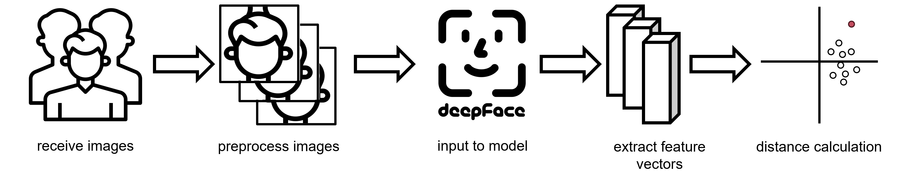
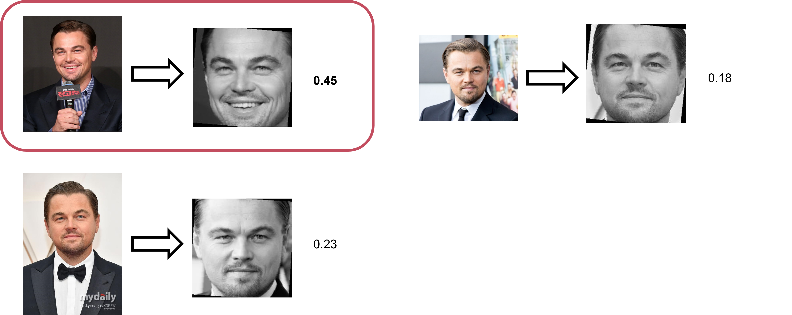

# Emotion Analysis

This directory includes codes for emotion analysis for `menu consensus`.

The contents include codes referenced from `DeepFace`.

## Directory Structure
```
/
    /emotion.py
    /model.py
```
`emotion.py`: codes that preprocess images, feed preprocessed images to DeepFace based model, and calculate distances between each feature vectors.

`model.py`: codes that load model from DeepFace framework and modify models to fit our project properly.
## Explanation



* `analysis` function in `emotion.py` gets list of images as input. The images are preprocessed by cropping detected faces, resizing cropped images, and applying grayscale to images.

* The preprocessed images are then fed to model loaded from `loadModel` function in `model.py`. The model is primarily from * DeepFace framework. Model's classifier is removed for efficient feature vectorization.
* Cosine distance is computed of obtained feature vectors from model to detect image with largest emotional change.
* For efficient and accurate cosine distance calculation, mean vector of all feature vectors is used.

## Example



## Q&A

Please contact by jangseokwoo@gm.gist.ac.kr for further question.
