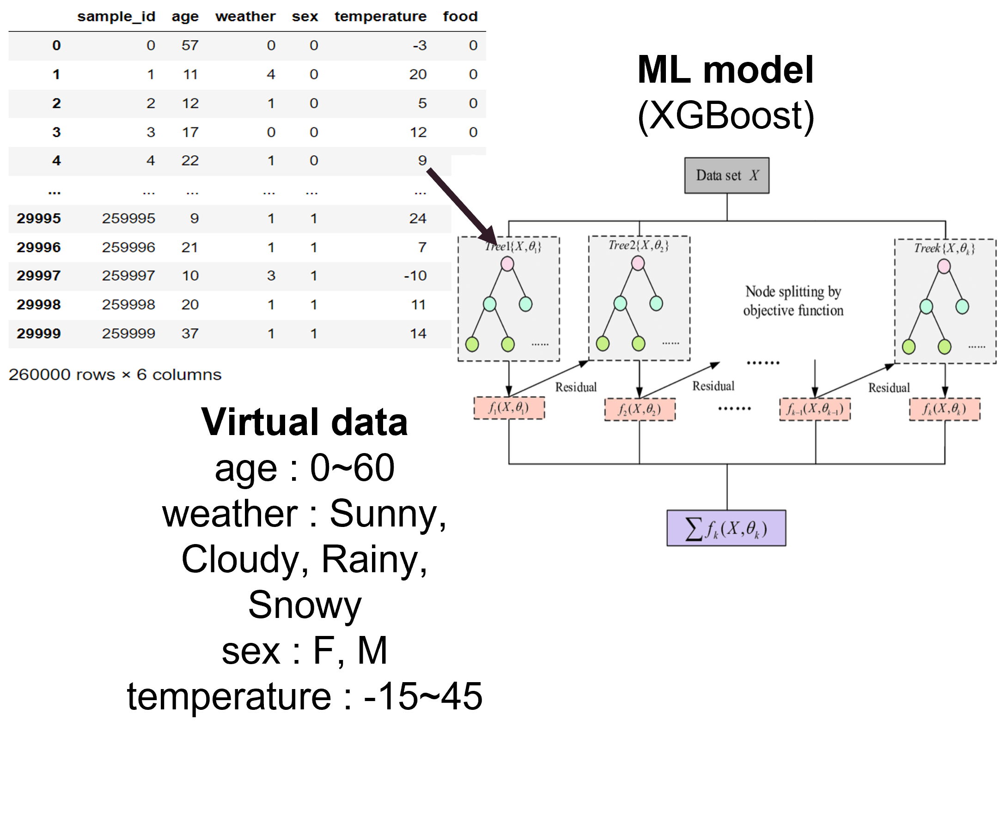

# Personal Recommendation

This directory includes codes for personal recommendation

## Directory Structure
```
/
    /Recommend.py
    /saved_model.pkl
    /requirement.txt
```
`Recommend.py`: codes that generate virtual dataset and predict with XGBoost

`saved_model.pkl`: trainned XGBoost model

## Explanation



* 'data_generation' function in 'Recommend.py' generate Biased data

* 'skf' function in 'Recommend.py' split data with label balanced train, val datast

* 'model_trainning' function in 'Recommend.py' train model with train dataset

* 'testdata' function in 'Recommend.py' encode test_input to model adjusted data

* 'recommend' function in 'Recommend.py' finally recommend 5 menu
